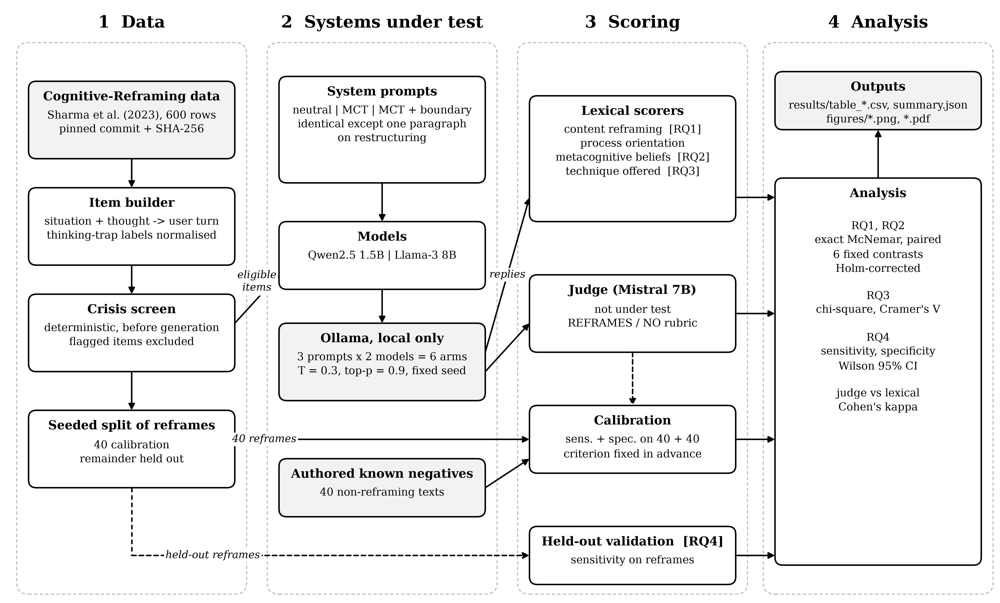
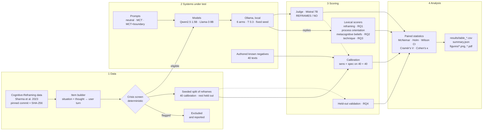

# MCT-Reframe-Bench

**Process, not content: when told to deliver metacognitive therapy, do language models still reframe the thought?**

Metacognitive therapy (MCT; Wells, 2009) does not dispute what a negative
thought says. It works on how a person *responds* to the thought (prolonged
worry or rumination, threat monitoring, unhelpful coping) and on the
*metacognitive beliefs* that keep that response going: that the thinking cannot
be controlled, or that it is useful. Cognitive restructuring does the opposite.
It asks whether the thought is true and offers a more balanced alternative.
That is cognitive therapy, and MCT deliberately excludes it.

Language models are trained on large amounts of CBT-style self-help text. This
benchmark measures how often a model told to deliver MCT reframes the content
of a thought anyway. It also measures whether stating the boundary explicitly
in the prompt changes that behaviour. Each model sees only a situation and a
thought. Nobody asks it to reframe, so any reframing is the model's default.

---

## Research questions

| | Question | Measure |
|---|---|---|
| **RQ1** | How often does each arm reframe thought content when not asked to, and does stating the restructuring boundary reduce it? | Content-reframing rate (lexical and judge), paired contrasts |
| **RQ2** | Does the reply address metacognitive beliefs (uncontrollability, usefulness of thinking) rather than the thought? | Metacognitive-belief targeting rate |
| **RQ3** | Does the technique offered depend on the thinking-trap category? | Trap × technique association (χ², Cramér's V); a depression-typical subset fixed in advance |
| **RQ4** | Do the automated detectors recognise content reframing when it is present? | Sensitivity and specificity on a calibration set, then sensitivity on held-out human reframes |

The study measures **adherence to the MCT model only**. It makes no claims
about patient outcomes, clinical effectiveness or any diagnostic population
(see [Limitations](#limitations)).

---

## Design

### Arms: 3 prompts × 2 models

| Prompt | Content |
|---|---|
| `neutral` | a general helpful assistant; no therapeutic specification |
| `mct` | an MCT specification written for this study from Wells (2009): name the process, offer one technique (detached mindfulness, postponement, attention shifting), optionally ask about beliefs about thinking |
| `mct+boundary` | `mct` **plus one paragraph** forbidding questioning the thought's truth, weighing evidence, labelling thinking errors, or offering a more balanced alternative |

The two MCT prompts differ only in that final paragraph ([arms.py](reframebench/arms.py)),
so the `mct` → `mct+boundary` contrast isolates the effect of stating the boundary.

| Model | Size |
|---|---|
| Qwen2.5-1.5B-Instruct (`qwen2.5:1.5b-instruct`) | 1.5B |
| Llama-3-8B-Instruct (`llama3`) | 8B |

Six arms: `qwen-neutral`, `qwen-mct`, `qwen-mct+boundary`, `llama3-neutral`,
`llama3-mct`, `llama3-mct+boundary`. All arms use the same decoding settings
(temperature 0.3, top-p 0.9, 400 tokens) and seed (20261005).

### Pre-specified contrasts

| | From → To | Isolates |
|---|---|---|
| C1 | qwen-neutral → qwen-mct | specifying MCT, 1.5B |
| C2 | qwen-mct → qwen-mct+boundary | stating the boundary, 1.5B |
| C3 | llama3-neutral → llama3-mct | specifying MCT, 8B |
| C4 | llama3-mct → llama3-mct+boundary | stating the boundary, 8B |
| C5 | qwen-mct → llama3-mct | model size, MCT prompt |
| C6 | qwen-mct+boundary → llama3-mct+boundary | model size, MCT + boundary prompt |

The three binary outcomes are reframing, process orientation and belief
targeting. Each contrast is tested with an exact McNemar test, paired over
items, and Holm-corrected within each outcome.

### Scoring

| Scorer | Basis | A hit means |
|---|---|---|
| Content reframing (lexical) | the moves of cognitive restructuring (Beck, 2011; Burns, 1980), split into five groups: evidence testing, alternative thought, counter-statement, distortion labelling, positive reappraisal | the reply works on the thought's truth or content |
| Process orientation | MCT (Wells, 2009) | names the process (rumination, worry, dwelling) or offers an MCT technique |
| Metacognitive beliefs | Wells' S-REF model | questions control over the thinking (*uncontrollability*) or its value (*usefulness*) |
| Technique | MCT techniques | postponement › attention shifting › detached mindfulness (most specific wins) |
| Judge | Mistral 7B, which is not one of the systems under test, with a REFRAMES / NO rubric | independent check of content reframing |

All lexicons were written before any reply was generated ([scoring.py](reframebench/scoring.py)).

### Judge calibration and detector validation (RQ4)

The 600 human-written reframes in the source data are, by construction,
content reframing. No arm ever sees them. A seeded split divides them:

- **Calibration:** 40 reframes as known positives, plus 40 known negatives
  written for this study ([calibration.py](reframebench/calibration.py)): 20
  process-level MCT replies, 10 purely empathic replies and 10 practical
  suggestions. Both detectors are scored for sensitivity and specificity.
  **The pre-specified criterion is that the judge counts as a primary
  measure only if both sensitivity and specificity are at least 0.80.**
  Otherwise the lexical detector is primary and the judge is reported as
  secondary.
- **Held out:** the remaining reframes are used only to estimate each
  detector's sensitivity.

Calibration runs **before** any generated reply is judged, so the judge is
never tuned on the outputs it rates.

---

## Architecture



The same pipeline in Mermaid (GitHub renders it directly):



---

## Repository layout

```
MCT-Reframe-Bench/
├── run.py                   command-line entry point (all stages)
├── run_all.ps1              runs every stage in a detached window, with a log
├── requirements.txt
├── reframebench/
│   ├── config.py            paths, pinned commit + hashes, seed, split size, judge criterion
│   ├── data.py              fetch + verify, trap normalisation, items, crisis screen, split
│   ├── safety.py            deterministic crisis screen
│   ├── arms.py              prompts and the six arms
│   ├── backend.py           Ollama generation with pinned decoding
│   ├── scoring.py           lexical scorers
│   ├── judge.py             judge rubric and parser
│   ├── calibration.py       the 40 known negatives
│   ├── pipeline.py          calibrate / validate / generate / judge (all resumable)
│   ├── io_utils.py          crash-safe resumable CSV writer, single-instance lock
│   ├── stats.py             McNemar, Holm, Wilson, kappa, Cramér's V
│   ├── analysis.py          tables + summary.json
│   ├── figures.py           result figures (from tables only)
│   └── architecture.py      architecture diagram
├── tests/                   unit tests (no network, no models)
├── data/                    downloaded data and built items (git-ignored)
├── results/                 outputs; files containing text are git-ignored
└── figures/                 generated figures
```

---

## Setup

You need Python 3.10 or newer and [Ollama](https://ollama.com).

```powershell
git clone https://github.com/joelbkoshy/MCT-Reframe-Bench.git
cd MCT-Reframe-Bench
python -m venv .venv
.\.venv\Scripts\Activate.ps1          # macOS/Linux: source .venv/bin/activate
pip install -r requirements.txt

ollama pull qwen2.5:1.5b-instruct
ollama pull llama3
ollama pull mistral

python -m unittest discover -s tests -t .
```

---

## Running the benchmark, step by step

Each stage reads the previous stage's output from disk. The calibrate,
validate, generate and judge stages can be resumed: if you interrupt one and
run it again, it repairs any half-written row and continues where it stopped.
A lock stops two runs from writing to the same results at once.

| # | Command | What it does | Output |
|---|---|---|---|
| 1 | `python run.py fetch` | downloads the source data at commit `4c1d4af` and checks its SHA-256 hashes | `data/upstream/` |
| 2 | `python run.py build` | builds one item per row (`R000`–`R599`), runs the crisis screen, makes the seeded calibration split | `data/items.jsonl`, `results/screening.json` |
| 3 | `python run.py calibrate` | the judge and the lexical detector rate the 40 + 40 calibration texts | `results/calibration.csv` |
| 4 | `python run.py validate` | both detectors rate the held-out human reframes | `results/validation.csv` |
| 5 | `python run.py generate` | 6 arms × every eligible item; each reply is scored as soon as it is written | `results/runs.csv` |
| 6 | `python run.py judge` | the judge rates every generated reply | `results/judgements.csv` |
| 7 | `python run.py analyse` | all tables and tests | `results/table_*.csv`, `results/summary.json` |
| 8 | `python run.py figures` | all result figures | `figures/fig*.png`, `.pdf` |

Useful options:

```powershell
python run.py status                               # progress of every stage
python run.py generate --limit 20                  # pilot on the first 20 items
python run.py generate --arms qwen-mct qwen-mct+boundary
python run.py validate --no-judge                  # lexical detector only
```

To run every stage unattended (the window keeps running if VS Code is closed):

```powershell
Start-Process powershell -ArgumentList "-NoProfile","-ExecutionPolicy","Bypass","-File","run_all.ps1","-Python","python" -WindowStyle Minimized
Get-Content results\run_log.txt -Tail 5 -Wait      # follow progress
```

If a stage fails, the script stops and records the failure in the log. Run
the same command again to resume. Keep the machine awake while it runs.

A manifest (`results/run_manifest.json`) ties the generations to the item hash
and the decoding settings. If either changes, `generate` refuses to append to
the existing results.

### Analysis outputs

| Table | Contents |
|---|---|
| `table_calibration.csv` | sensitivity and specificity (Wilson 95% CI) for each detector, and whether the pre-specified criterion is met |
| `table_calibration_by_kind.csv` | flag rate for human reframes and for each kind of negative |
| `table_detector_validation.csv` | held-out sensitivity of each detector |
| `table_by_arm.csv` | reframing (lexical and judge), process orientation, belief targeting, techniques, refusals, length, latency |
| `table_reframing_moves.csv` | which restructuring moves each arm uses |
| `table_reframing_by_arm_trap.csv` | reframing rate by arm × thinking trap |
| `table_depression_typical.csv` | the a-priori depression-typical subset vs the rest |
| `table_contrasts.csv` | C1–C6: exact McNemar on each outcome, Holm-corrected |
| `table_technique_by_trap.csv`, `table_personalization.csv` | RQ3 distributions, χ², Cramér's V |
| `summary.json` | everything above, plus screening counts and lexical-vs-judge agreement (Cohen's κ) |

---

## Generating figures from Python

The figures are built **only from `results/table_*.csv`**. You do not need the
models or the raw replies to redraw or restyle them.

```powershell
python run.py figures               # all result figures
python run.py architecture          # the architecture diagram (needs no data)
python -m reframebench.figures      # same as `run.py figures`
```

To draw a single figure, or to use the figure code in a notebook:

```python
from reframebench import figures

figures.fig_reframing_by_arm()       # figures/fig1_reframing_by_arm.png + .pdf
figures.fig_detector_validation()    # figures/fig6_detector_validation.png + .pdf
```

| File | Shows | Built from |
|---|---|---|
| `architecture` | the pipeline | [architecture.py](reframebench/architecture.py) |
| `fig1_reframing_by_arm` | RQ1: reframing rate per arm, lexical and judge, 95% CI | `table_by_arm.csv` |
| `fig2_reframing_by_trap` | RQ1 × RQ3: heat map, arm × thinking trap | `table_reframing_by_arm_trap.csv` |
| `fig3_metacognitive_beliefs` | RQ2: uncontrollability vs usefulness targeting | `table_by_arm.csv` |
| `fig4_technique_by_trap` | RQ3: technique mix per trap, one panel per arm | `table_technique_by_trap.csv` |
| `fig5_process_vs_reframing` | process orientation against reframing, per arm | `table_by_arm.csv` |
| `fig6_detector_validation` | RQ4: calibration sensitivity and specificity, held-out sensitivity, with the 0.80 criterion line | `table_calibration.csv`, `table_detector_validation.csv` |

All figures use the same conventions:

- greyscale with hatching;
- a serif font;
- no title or caption inside the image;
- a 600 dpi PNG plus a vector PDF.

To change a figure, edit [figures.py](reframebench/figures.py) and run
`python run.py figures` again.

---

## Reproducibility

- **Inputs:** an upstream commit pinned in [config.py](reframebench/config.py), checked by SHA-256 hash. Item building and the calibration split are deterministic (seed 20261005).
- **Decoding:** identical for every arm and fixed in [backend.py](reframebench/backend.py). The judge uses the same settings with 80 tokens.
- **Run integrity:** the manifest ties generations to the item hash and the decoding settings, and the CSV writer repairs truncated rows before resuming.
- **Local only:** all models run through a local Ollama server, so no text leaves the machine.

## Data, licence and ethics

- The **Cognitive-Reframing** data (Sharma et al., 2023) are licensed
  **CC BY-NC-ND 4.0**. This repository does not redistribute them; `fetch`
  downloads them from the original repository.
- Every file that contains source text, or model replies that may quote it,
  is git-ignored.
- The released tables carry only item IDs and statistics.
- The source texts were written by crowdworkers and include no clinical
  records. Every input still passes through the crisis screen, and flagged
  items are excluded and counted.
- Use is for non-commercial research only, as the source licence requires.
- **Code:** MIT ([LICENSE](LICENSE)).

## Limitations

- **Detector validity.** The lexical scorers are proxies. The known
  negatives were written by the researchers, so specificity is estimated
  against those authored texts, not against real model output. Any claim of
  clinical correctness needs practitioner ratings of a stratified sample of
  replies.
- **Register.** The human reframes are first-person rewrites, while model
  replies address the person. Sensitivity on the reframes may therefore
  differ from sensitivity on replies.
- **Labels.** The thinking-trap labels come from the source annotators. The
  depression-typical subset is a reporting convention fixed in advance, not a
  diagnostic grouping.
- **Population.** The thoughts come from everyday situations, not a clinical
  population.
- **Scope.** One seed, two model families and one judge.

## References

- Beck, J. S. (2011). *Cognitive Behavior Therapy: Basics and Beyond* (2nd ed.). Guilford Press.
- Burns, D. D. (1980). *Feeling Good: The New Mood Therapy*. William Morrow.
- Sharma, A., Rushton, K., Lin, I. W., Wadden, D., Lucas, K. G., Miner, A. S., Nguyen, T., & Althoff, T. (2023). Cognitive reframing of negative thoughts through human-language model interaction. *Proceedings of ACL 2023*.
- Wells, A. (2009). *Metacognitive Therapy for Anxiety and Depression*. Guilford Press.

## Citation

```bibtex
@software{koshy_mct_reframe_bench,
  author = {Koshy, Joel B. and {Rajesh Kanna R.}},
  title  = {{MCT-Reframe-Bench}: Process-versus-content adherence of
            MCT-instructed language models},
  year   = {2026},
  url    = {https://github.com/joelbkoshy/MCT-Reframe-Bench}
}
```
